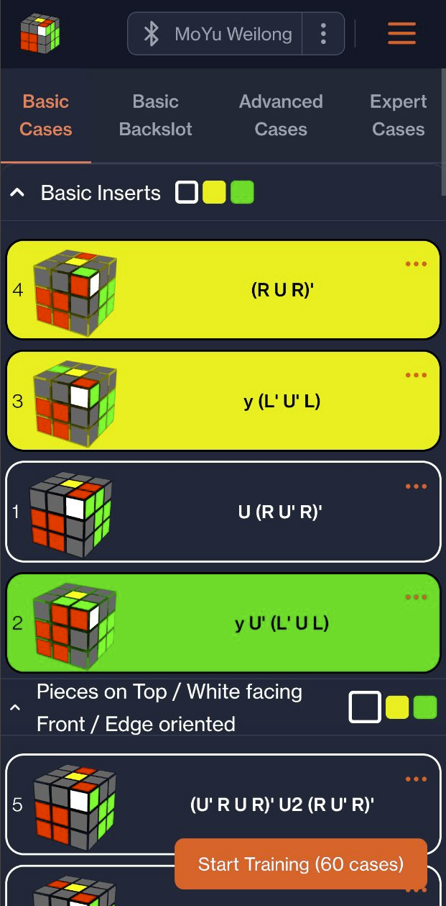
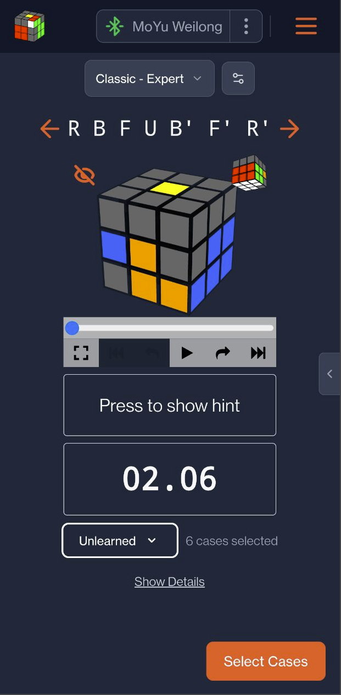
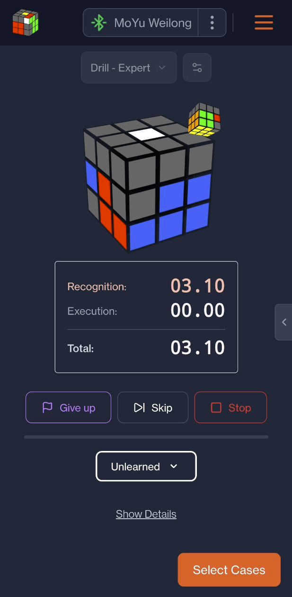
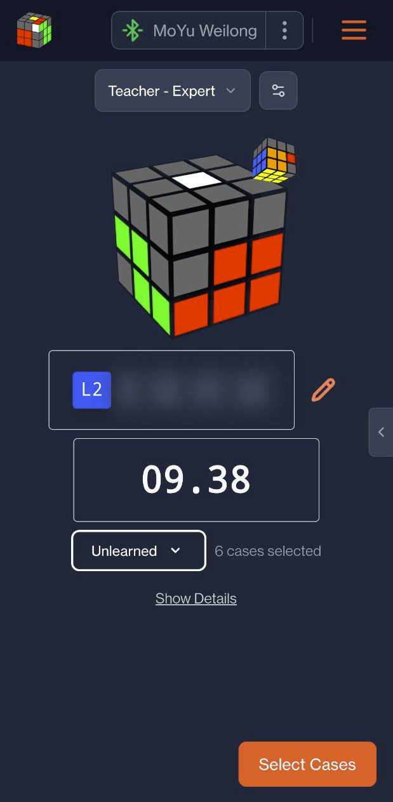
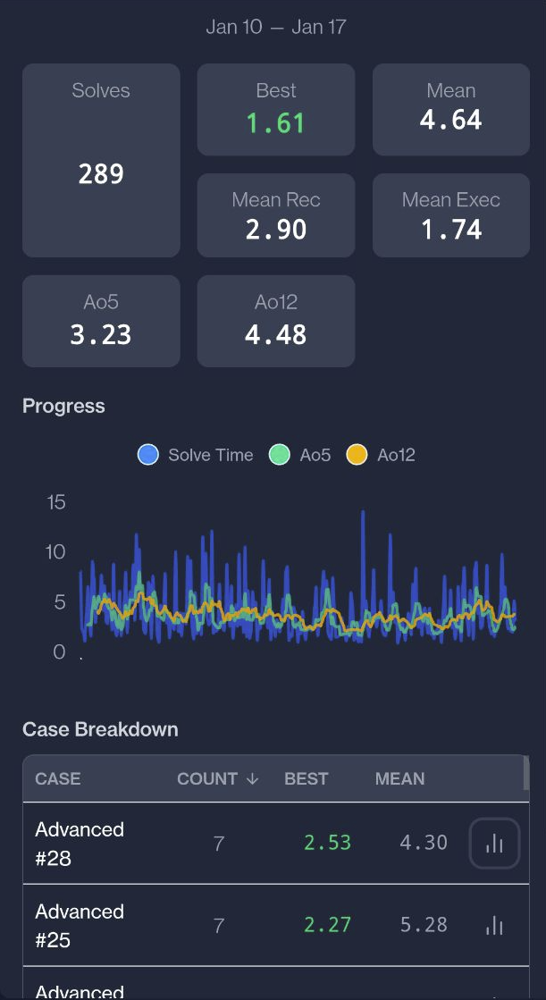
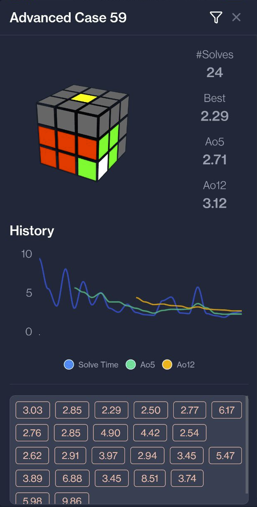

# F2LTrainer-Svelte 🧩


**A speedcubing training application for F2L (First 2 Layers), featuring 3D cube rendering, algorithmic training, and smart cube integration.**

> 🚀 **[Live Demo](https://your-demo-link.com)** (Replace with your link or remove)

## ✨ Features

- **🎯 Specialized Training:** Dedicated modes for learning and drilling F2L algorithms.
- **🦷 Bluetooth Smart Cube Support:** Connect your smart cube directly to get real-time feedback and automatic timing.
- **🧊 3D Visualization:** Interactive 3D cube player powered by `cubing.js`.
- **📊 Statistics:** Track your progress with detailed charts and session history.
- **📱 Responsive Design:** Fully optimized for desktop and mobile devices.

## 🛠️ Built With

- **Framework:** [Svelte 5](https://svelte.dev) & SvelteKit
- **Styling:** [TailwindCSS v4](https://tailwindcss.com) & [Flowbite](https://flowbite.com)
- **Cube Logic:** [cubing.js](https://js.cubing.net/cubing/)
- **Charts:** ApexCharts

---

## 📸 Screenshots

### Selection & Training

|                                 Case Selection                                 |                                   Classic Training                                    |
| :----------------------------------------------------------------------------: | :-----------------------------------------------------------------------------------: |
|  |  |

|                                  Drill Mode                                   |                                  Smart Cube Integration                                   |
| :---------------------------------------------------------------------------: | :---------------------------------------------------------------------------------------: |
|  |  |

### Statistics

|                                  Session Insights                                   |                                Case Analysis                                 |
| :---------------------------------------------------------------------------------: | :--------------------------------------------------------------------------: |
|  |  |

---

## 💻 Development Setup

Follow these steps to set up the project on a **fresh Windows 11** machine.

### 1️⃣ Install Node.js (LTS)

Download and install the **LTS version** of Node.js from:  
👉 [https://nodejs.org/en/download](https://nodejs.org/en/download)

During installation, make sure to **check**

> ✅ _“Automatically install necessary tools”_

This ensures required build tools are set up.

> 💡 **Note:** A restart of your PC may be required after installation for Node.js to work correctly in the terminal.

---

### 2️⃣ Verify Installation

Open a terminal (PowerShell or Windows Terminal) and check:

```bash
node -v
pnpm -v
```

You should see versions printed for both commands.  
If pnpm is not installed, install it with:

```bash
npm install -g pnpm
```

---

### 3️⃣ Clone the Repository

Clone this project from GitHub and navigate into it:

```bash
git clone https://github.com/Dave2ooo/F2LTrainer-Svelte.git
cd F2LTrainer-Svelte
```

---

### 4️⃣ Install Dependencies

Run:

```bash
pnpm install
```

This installs all required packages defined in the project’s `pnpm-lock.yaml`.

---

### 5️⃣ Start the Development Server

Launch the app locally with:

```bash
pnpm run dev
```

Then open your browser at the address shown in the terminal (usually [http://localhost:5173](http://localhost:5173)).

---

### ✅ Done!

You’re ready to start developing!  
The project uses **SvelteKit**, **TypeScript**, **TailwindCSS**, and **Flowbite** — all preconfigured.
