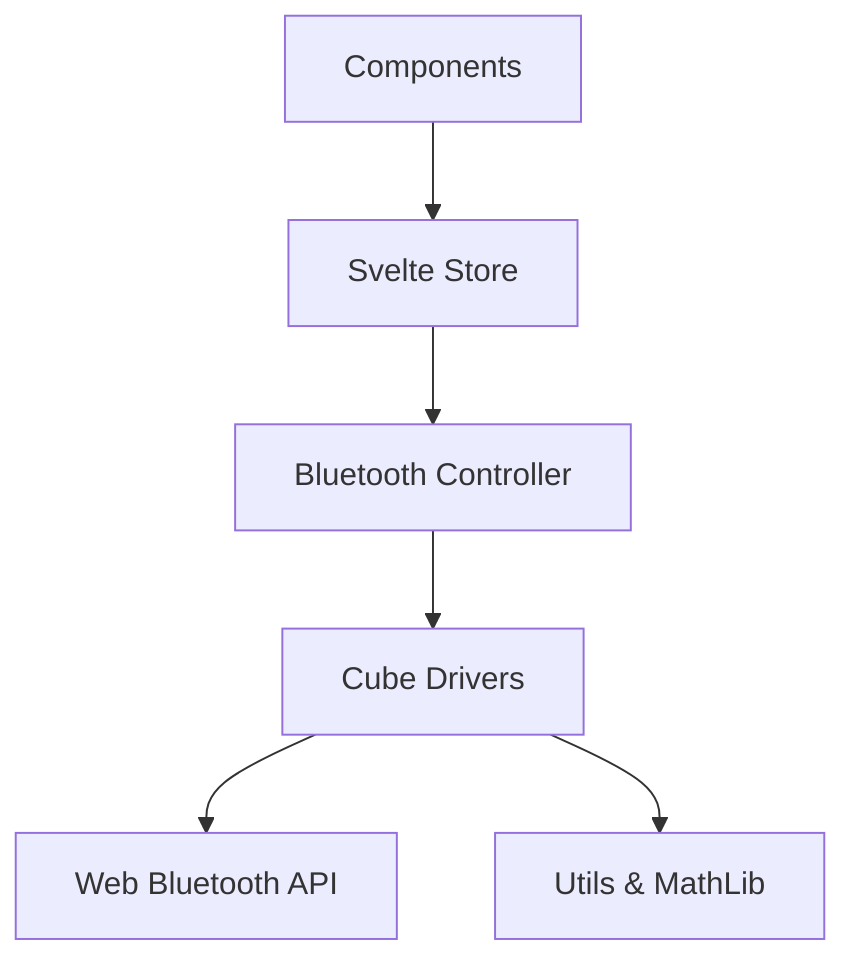

# Bluetooth Implementation Documentation

This directory contains a TypeScript port of the smart cube Bluetooth implementation from [csTimer](https://cstimer.net/). It has been adapted for use in a Svelte 5 application.

## 1. Overview

The purpose of this module is to enable Web Bluetooth communication with various smart cubes (GAN, GoCube, MoYu, QiYi, etc.). It behaves as a "shim" layer that allows the original csTimer cube drivers to run within a modern Svelte/TypeScript environment with minimal changes.

## 2. Architecture

The system is built on a layered architecture:



### Core Components (`src/lib/bluetooth/core/`)

*   **`bluetooth.ts`**: The central controller singleton (`GiikerCube`).
    *   **Role**: Manages the connection lifecycle (scan, connect, disconnect) and delegates events to the appropriate driver.
    *   **Key Behavior**: It aggregates "filters" (Service UUIDs) from all registered drivers to pass to `navigator.bluetooth.requestDevice()`.
*   **`mathlib.ts`**: A partial port of csTimer's math library.
    *   **Role**: Provides the `CubieCube` class for representing cube state (permutation/orientation) and applying moves.
    *   **Crucial For**: Cubes that report state (like Giiker) rather than moves. The library calculates the difference between the previous and current state to derive the move string (e.g., "R").
*   **`aes.ts`**: A dedicated AES-128 implementation.
    *   **Role**: Handles decryption for cubes like GAN and MoYu AI that encrypt their Bluetooth traffic to prevent reverse-engineering.
*   **`utils.ts`**: The "Compatibility Layer".
    *   **Role**: Emulates the `kernel` object from csTimer. It provides `kernel.prop()` for persistent settings and `kernel.getProp()` for retrieving them, mapping them to local logic or stores.

### Cube Drivers (`src/lib/bluetooth/cubes/`)

Each file handles a specific hardware protocol. They are designed to be as close to the original source as possible to facilitate future updates from csTimer.

*   **`gancube.ts`**: Complex. Uses AES. Needs explicit handshake.
*   **`moyu32cube.ts`**: MoYu AI 2020+. Handshake required.
*   **`gocube.ts`**: GoCube/Rubik's Connected. simpler protocol.
*   **`giikercube.ts`**: The reference implementation. Report state changes.

## 3. Data Flow

1.  **Connection**: User clicks "Connect" -> `GiikerCube.init()` -> Browser Scan -> Driver `connect()` -> Handshake (if needed).
2.  **Event Loop**:
    *   Cube hardware sends a notification (Characteristic Value Changed).
    *   Driver receives raw `DataView`.
    *   Driver decrypts data (if needed).
    *   Driver parses data (e.g., identifies face turn).
    *   Driver calls `callback(faceletStr, moveList)`.
3.  **State Update**:
    *   `callback` updates `store.svelte.ts`.
    *   `lastMove` is updated.
    *   `moveCounter` is incremented (CRITICAL for detecting repeated moves like "U U").
4.  **UI Reaction**:
    *   `BluetoothModal` observes `moveCounter`.
    *   `TwistyPlayer` applies the move.

## 4. Deep Dive: Porting Strategy

If you need to update a driver or add a new one from csTimer, follow this guide.

### The Problem
csTimer uses a global `kernel` object and older ES5 class patterns. It assumes `mathlib` is globally available.

### The Solution
We use **Dependency Injection via Modules**.

1.  **Global Simulation**: `utils.ts` exports `deviceList`, `kernel`, `DEBUG`, etc.
    *   *Action*: Import these at the top of any new driver file.
2.  **Math Library**: `mathlib.ts` exports `CubieCube`.
    *   *Action*: Import `{ CubieCube }` instead of relying on `window.CubieCube`.
3.  **Registration**:
    *   *Original*: `GiikerCube.regCubeModel({ ... })` happened at script load.
    *   *Ported*: We explicitly call `GiikerCube.regCubeModel` in the driver file, but we **MUST** import the file in `src/lib/bluetooth/index.ts` for this code to run.

### Example: Porting `newcube.js`

**Step 1: Copy file to `src/lib/bluetooth/cubes/newcube.ts`**

**Step 2: Add Imports**
```typescript
import { GiikerCube } from '../core/bluetooth';
import { CubieCube } from '../core/mathlib';
import { DEBUG, kernel } from '../core/utils';
```

**Step 3: Fix Types**
Add specific types to function arguments (usually `DataView` for raw data).

**Step 4: Register**
Ensure `src/lib/bluetooth/index.ts` has:
```typescript
import './cubes/newcube';
```

## 5. Important Implementation Details

### AES Encryption
Cubes like GAN use AES-128. The keys are often derived from the cube's MAC address or a fixed handshake.
*   **`aes.ts`** provides `AES128` class.
*   **Key Handling**: Keys are often pre-computed (brute-forced/extracted) and stored in the driver (see `MOYU_KEYS` in `moyucube.ts` or `GAN_KEYS` logic).

### Move Detection
Two types of cubes exist:
1.  **Move-based**: Sends "I turned U face". (Easy, e.g., GoCube).
2.  **State-based**: Sends "Here is my entire internal state". (Hard, e.g., Giiker).
    *   For state-based, `mathlib.ts` is used to compare `currentState` vs `previousState` to deduce the move.

### Troubleshooting

*   **"Parsing unexpectedly ended early"**:
    *   *Cause*: Driver sent a move string with trailing whitespace (e.g., "U ") or invalid formatting.
    *   *Fix*: Ensure `move.trim()` is called before passing to `TwistyPlayer`.
*   **Repeated moves ignored**:
    *   *Cause*: Svelte reactivity optimizations. If `lastMove` changes from "U" to "U", Svelte sees no change.
    *   *Fix*: Use `moveCounter` in the store to force an update.
*   **Garbage Data / Connection Instability**:
    *   *Cause*: iOS/Mac vs Windows Bluetooth implementation differences, or incorrect decryption key.
    *   *Fix*: Check `aes.ts` logic and ensure the handshake (sending specific bytes on connect) is correct for that specific firmware version.

## 6. API Reference

### `store.svelte.ts`
*   `bluetoothState.isConnected`: `bool`
*   `bluetoothState.lastMove`: `string` (e.g. "R", "U'")
*   `bluetoothState.moveCounter`: `number` (Monotonic counter)
*   `bluetoothState.batteryLevel`: `number` (0-100)

### `GiikerCube` (Controller)
*   `init()`: Start connection flow.
*   `stop()`: Disconnect.

## 7. Future Work
*   **New Drivers**: Watch csTimer repo for new cube protocols.
*   **Firmware Updates**: Some cubes might change protocols via firmware updates, requiring driver adjustments.
*   **Performance**: `mathlib.ts` is running in the main thread. If complex solving logic is added, consider moving it to a Web Worker.

## Appendix: Source File Mapping

To assist with future maintenance and porting, here is the mapping between the original csTimer source files and this project's structure:

| csTimer File (Original) | F2LTrainer File (Ported) | Key Changes |
| ----------------------- | ------------------------ | ----------- |
| `js/bluetooth.js` | `src/lib/bluetooth/core/bluetooth.ts` | Converted to Singleton, added types, removed UI-dom coupling. |
| `js/mathlib.js` | `src/lib/bluetooth/core/mathlib.ts` | Ported only `CubieCube` and rotation tables. Removed Kociemba solver to reduce size. |
| `js/kernel.js` (mocked) | `src/lib/bluetooth/core/utils.ts` | Created `kernel` shim to provide `getProp`/`prop` methods used by drivers. |
| `js/cubes/gancube.js` | `src/lib/bluetooth/cubes/gancube.ts` | Extracted AES logic to `aes.ts`. Added types for `DataView`. |
| `js/cubes/giikercube.js`| `src/lib/bluetooth/cubes/giikercube.ts`| Added explicit registration calls. |
| *(Inline AES logic)* | `src/lib/bluetooth/core/aes.ts` | Refactored spaghetti bit-shifting into a reusable `AES128` class. |
