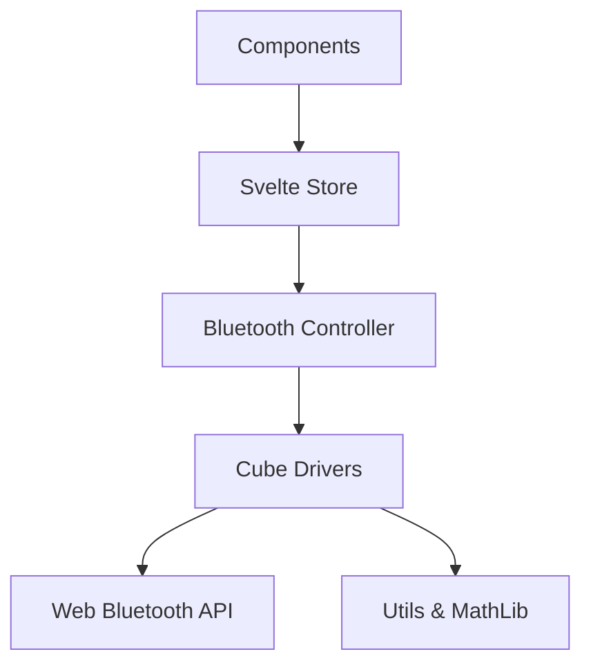

# Bluetooth Implementation Documentation

This directory contains a TypeScript port of the smart cube Bluetooth implementation from [csTimer](https://cstimer.net/). It has been adapted for use in a Svelte 5 application.

## 1. Overview

The purpose of this module is to enable Web Bluetooth communication with various smart cubes (GAN, GoCube, MoYu, QiYi, etc.). It behaves as a "shim" layer that allows the original csTimer cube drivers to run within a modern Svelte/TypeScript environment with minimal changes.

## 2. Architecture

The system is built on a layered architecture:



### Core Components (`src/lib/bluetooth/core/`)

- **`bluetooth.ts`**: The central controller singleton (`GiikerCube`).
  - **Role**: Manages the connection lifecycle (scan, connect, disconnect) and delegates events to the appropriate driver.
  - **Key Behavior**: It aggregates "filters" (Service UUIDs) from all registered drivers to pass to `navigator.bluetooth.requestDevice()`.
- **`mathlib.ts`**: A partial port of csTimer's math library.
  - **Role**: Provides the `CubieCube` class for representing cube state (permutation/orientation) and applying moves.
  - **Crucial For**: Cubes that report state (like Giiker) rather than moves. The library calculates the difference between the previous and current state to derive the move string (e.g., "R").
- **`aes.ts`**: A dedicated AES-128 implementation.
  - **Role**: Handles decryption for cubes like GAN and MoYu AI that encrypt their Bluetooth traffic to prevent reverse-engineering.
- **`utils.ts`**: The "Compatibility Layer".
  - **Role**: Emulates the `kernel` object from csTimer. It provides `kernel.prop()` for persistent settings and `kernel.getProp()` for retrieving them, mapping them to local logic or stores.

### Cube Drivers (`src/lib/bluetooth/cubes/`)

Each file handles a specific hardware protocol. They are designed to be as close to the original source as possible to facilitate future updates from csTimer.

- **`gancube.ts`**: Complex. Uses AES. Needs explicit handshake.
- **`moyu32cube.ts`**: MoYu AI 2020+. Handshake required.
- **`gocube.ts`**: GoCube/Rubik's Connected. simpler protocol.
- **`giikercube.ts`**: The reference implementation. Report state changes.

### State Management (`src/lib/bluetooth/`)

- **`store.svelte.ts`**: Main Bluetooth state store
  - Manages connection state, device info, battery level
  - Handles MAC address requests via custom UI
  - Tracks moves and cube state changes
- **`savedCubes.svelte.ts`**: Saved cubes management
  - Persists cube data to localStorage
  - Tracks custom names, device IDs, and last connection times
  - Provides methods to add, remove, rename, and retrieve saved cubes

## 3. Data Flow

1.  **Connection**: User clicks "Connect" -> `GiikerCube.init()` -> Browser Scan -> Driver `connect()` -> Handshake (if needed).
2.  **Event Loop**:
    - Cube hardware sends a notification (Characteristic Value Changed).
    - Driver receives raw `DataView`.
    - Driver decrypts data (if needed).
    - Driver parses data (e.g., identifies face turn).
    - Driver calls `callback(faceletStr, moveList)`.
3.  **State Update**:
    - `callback` updates `store.svelte.ts`.
    - `lastMove` is updated.
    - `moveCounter` is incremented (CRITICAL for detecting repeated moves like "U U").
4.  **UI Reaction**:
    - `BluetoothModal` observes `moveCounter`.
    - `TwistyPlayer` applies the move.

## 4. Saved Cubes Feature

The application includes a saved cubes management system that allows users to save, rename, and quickly reconnect to their Bluetooth cubes.

### Features

- **Save Cubes**: After connecting to a cube, users can save it with a custom name
- **Quick Connect**: One-click reconnection to previously saved cubes
- **Rename**: Edit custom names for saved cubes
- **Remove**: Delete saved cubes from the list
- **Persistence**: All saved cube data is stored in localStorage
- **Last Connected**: Displays relative timestamps (e.g., "5m ago", "2h ago")

### Implementation

The saved cubes system consists of:

1.  **`savedCubes.svelte.ts`**: Core state management
    - `SavedCube` interface with id, customName, deviceName, dateAdded, lastConnected
    - Methods: `addCube()`, `removeCube()`, `renameCube()`, `updateLastConnected()`, `getCube()`
    - Automatic localStorage sync

2.  **`store.svelte.ts`**: Device ID tracking
    - `deviceId` state variable to track currently connected cube's Bluetooth ID
    - Updated in `bluetooth.ts` on successful connection

3.  **`BluetoothModal.svelte`**: User interface
    - Displays list of saved cubes with connect/rename/remove actions
    - Shows custom name prominently when connected to a saved cube
    - "Save this cube" option appears for unsaved connected cubes
    - Custom confirmation modal (`RemoveCubeModal.svelte`) for deletions

### Usage

When connected to a cube:

- If it's a new cube, a "Save this cube" input appears
- Enter a custom name (e.g., "My Main Cube") and click Save
- The cube is now saved and will appear in the saved cubes list

When disconnected:

- Saved cubes appear in a list with their custom names
- Click "Connect" on any saved cube to reconnect instantly
- Use the edit icon to rename or trash icon to remove

## 5. HTTPS Requirement for Web Bluetooth

### Why HTTPS is Required

The Web Bluetooth API is **only available in secure contexts** (HTTPS or localhost). This is a browser security requirement to prevent malicious websites from accessing Bluetooth devices.

**Important**: When accessing the app from a mobile device over your local network (e.g., `http://192.168.1.x:5173`), the connection is considered insecure and Web Bluetooth will be blocked, even though it works on `localhost` on your development machine.

### Development Setup

The project is configured to use HTTPS in development via `@vitejs/plugin-basic-ssl`:

**vite.config.ts**:

```typescript
import basicSsl from '@vitejs/plugin-basic-ssl';

export default defineConfig({
	plugins: [basicSsl(), tailwindcss(), sveltekit()],
	server: {
		https: true,
		host: true // Allow access from local network
	}
	// ...
});
```

### Running the Dev Server

Simply run:

```bash
pnpm run dev --host
```

The server will automatically start with HTTPS enabled:

```
➜  Local:   https://localhost:5173/
➜  Network: https://10.2.0.2:5173/
➜  Network: https://192.168.1.178:5173/
```

### Mobile Testing

1. **Find your network URL** from the dev server output (e.g., `https://192.168.1.178:5173`)

2. **On your mobile device** (Android/iOS):
   - Open Chrome/Safari
   - Navigate to the HTTPS URL (e.g., `https://192.168.1.178:5173`)
   - You'll see a security warning about the self-signed certificate

3. **Accept the certificate warning**:
   - **Android Chrome**: Tap "Advanced" → "Proceed to [address] (unsafe)"
   - **iOS Safari**: Tap "Show Details" → "visit this website"

4. **The Bluetooth modal should now work!** The page is in a secure context.

### Error Handling

The app includes secure context detection in `utils.ts`:

```typescript
chkAvail: (): Promise<void> => {
	// Check if running in secure context (HTTPS or localhost)
	if (!window.isSecureContext) {
		return Promise.reject(
			'Web Bluetooth requires HTTPS. Please access this page via https:// instead of http://'
		);
	}
	// ... rest of availability checks
};
```

If a user tries to connect over HTTP, they'll see a clear error message explaining the requirement.

### Alternative: Production Deployment

When deployed to production (e.g., GitHub Pages, Vercel, Netlify), the site is automatically served over HTTPS, so no special configuration is needed. The Web Bluetooth API will work on all devices without certificate warnings.

## 6. Deep Dive: Porting Strategy

If you need to update a driver or add a new one from csTimer, follow this guide.

### The Problem

csTimer uses a global `kernel` object and older ES5 class patterns. It assumes `mathlib` is globally available.

### The Solution

We use **Dependency Injection via Modules**.

1.  **Global Simulation**: `utils.ts` exports `deviceList`, `kernel`, `DEBUG`, etc.
    - _Action_: Import these at the top of any new driver file.
2.  **Math Library**: `mathlib.ts` exports `CubieCube`.
    - _Action_: Import `{ CubieCube }` instead of relying on `window.CubieCube`.
3.  **Registration**:
    - _Original_: `GiikerCube.regCubeModel({ ... })` happened at script load.
    - _Ported_: We explicitly call `GiikerCube.regCubeModel` in the driver file, but we **MUST** import the file in `src/lib/bluetooth/index.ts` for this code to run.

### Example: Porting `newcube.js`

**Step 1: Copy file to `src/lib/bluetooth/cubes/newcube.ts`**

**Step 2: Add Imports**

```typescript
import { GiikerCube } from '../core/bluetooth';
import { CubieCube } from '../core/mathlib';
import { DEBUG, kernel } from '../core/utils';
```

**Step 3: Fix Types**
Add specific types to function arguments (usually `DataView` for raw data).

**Step 4: Register**
Ensure `src/lib/bluetooth/index.ts` has:

```typescript
import './cubes/newcube';
```

## 7. Important Implementation Details

### AES Encryption

Cubes like GAN use AES-128. The keys are often derived from the cube's MAC address or a fixed handshake.

- **`aes.ts`** provides `AES128` class.
- **Key Handling**: Keys are often pre-computed (brute-forced/extracted) and stored in the driver (see `MOYU_KEYS` in `moyucube.ts` or `GAN_KEYS` logic).

### MAC Address Handling

Some cubes require the MAC address for encryption key derivation. The app handles this with a custom UI:

1. **Automatic Detection**: Most modern cubes provide manufacturer data that includes the MAC address
2. **Manual Entry**: If automatic detection fails, a custom modal prompts the user to enter the MAC address
3. **Error Recovery**: If the wrong MAC is provided, the modal re-appears with an error message
4. **State Management**: MAC address requests are managed through `bluetoothState.macAddressRequest`

**Key Implementation Details**:

- `forcePrompt` parameter in cube drivers controls whether to always prompt or try auto-detection first
- Set to `false` to enable auto-detection (recommended)
- The `cics` field in cube model registration must include the correct Company Identifier Codes for manufacturer data retrieval
- Example from `gancube.ts`: `cics: GAN_CIC_LIST` where `GAN_CIC_LIST = [0x0001, 0x0101, 0x0201]`

### Move Detection

Two types of cubes exist:

1.  **Move-based**: Sends "I turned U face". (Easy, e.g., GoCube).
2.  **State-based**: Sends "Here is my entire internal state". (Hard, e.g., Giiker).
    - For state-based, `mathlib.ts` is used to compare `currentState` vs `previousState` to deduce the move.

### Troubleshooting

- **"Parsing unexpectedly ended early"**:
  - _Cause_: Driver sent a move string with trailing whitespace (e.g., "U ") or invalid formatting.
  - _Fix_: Ensure `move.trim()` is called before passing to `TwistyPlayer`.
- **Repeated moves ignored**:
  - _Cause_: Svelte reactivity optimizations. If `lastMove` changes from "U" to "U", Svelte sees no change.
  - _Fix_: Use `moveCounter` in the store to force an update.
- **Garbage Data / Connection Instability**:
  - _Cause_: iOS/Mac vs Windows Bluetooth implementation differences, or incorrect decryption key.
  - _Fix_: Check `aes.ts` logic and ensure the handshake (sending specific bytes on connect) is correct for that specific firmware version.
- **"Web Bluetooth API is not available"**:
  - _Cause_: Accessing the app over HTTP instead of HTTPS from a mobile device.
  - _Fix_: Use `https://` URL or see "HTTPS Requirement" section above.
- **Always prompts for MAC address**:
  - _Cause_: Missing `cics` field in cube model registration or `forcePrompt` set to `true`.
  - _Fix_: Ensure `cics` field is present and `forcePrompt` is `false` in the cube driver.

## 8. API Reference

### `store.svelte.ts`

- `bluetoothState.isConnected`: `bool`
- `bluetoothState.deviceId`: `string | null` - Bluetooth device ID
- `bluetoothState.deviceName`: `string | null`
- `bluetoothState.lastMove`: `string` (e.g. "R", "U'")
- `bluetoothState.moveCounter`: `number` (Monotonic counter)
- `bluetoothState.batteryLevel`: `number` (0-100)
- `bluetoothState.macAddressRequest`: Object for MAC address prompt state
- `bluetoothState.requestMacAddress()`: Trigger MAC address input
- `bluetoothState.submitMacAddress(mac)`: Submit MAC address
- `bluetoothState.cancelMacAddressRequest()`: Cancel MAC input

### `savedCubes.svelte.ts`

- `savedCubesState.cubes`: `SavedCube[]` - Array of saved cubes
- `savedCubesState.addCube(deviceId, customName, deviceName)`: Save a new cube
- `savedCubesState.removeCube(deviceId)`: Remove a saved cube
- `savedCubesState.renameCube(deviceId, newName)`: Rename a saved cube
- `savedCubesState.updateLastConnected(deviceId)`: Update last connection time
- `savedCubesState.getCube(deviceId)`: Get a saved cube by ID

### `GiikerCube` (Controller)

- `init()`: Start connection flow.
- `stop()`: Disconnect.

## 9. Future Work

- **New Drivers**: Watch csTimer repo for new cube protocols.
- **Firmware Updates**: Some cubes might change protocols via firmware updates, requiring driver adjustments.
- **Performance**: `mathlib.ts` is running in the main thread. If complex solving logic is added, consider moving it to a Web Worker.
- **Cloud Sync**: Sync saved cubes across devices via cloud storage.

## Appendix: Source File Mapping

To assist with future maintenance and porting, here is the mapping between the original csTimer source files and this project's structure:

| csTimer File (Original)  | F2LTrainer File (Ported)                 | Key Changes                                                                             |
| ------------------------ | ---------------------------------------- | --------------------------------------------------------------------------------------- |
| `js/bluetooth.js`        | `src/lib/bluetooth/core/bluetooth.ts`    | Converted to Singleton, added types, removed UI-dom coupling.                           |
| `js/mathlib.js`          | `src/lib/bluetooth/core/mathlib.ts`      | Ported only `CubieCube` and rotation tables. Removed Kociemba solver to reduce size.    |
| `js/kernel.js` (mocked)  | `src/lib/bluetooth/core/utils.ts`        | Created `kernel` shim to provide `getProp`/`prop` methods used by drivers.              |
| `js/cubes/gancube.js`    | `src/lib/bluetooth/cubes/gancube.ts`     | Extracted AES logic to `aes.ts`. Added types for `DataView`. Fixed `cics` registration. |
| `js/cubes/giikercube.js` | `src/lib/bluetooth/cubes/giikercube.ts`  | Added explicit registration calls.                                                      |
| _(Inline AES logic)_     | `src/lib/bluetooth/core/aes.ts`          | Refactored spaghetti bit-shifting into a reusable `AES128` class.                       |
| _(New)_                  | `src/lib/bluetooth/savedCubes.svelte.ts` | New feature for managing saved cubes with localStorage persistence.                     |
